## 출처: 인프런의 [강의](https://www.inflearn.com/course/%EC%8A%A4%ED%94%84%EB%A7%81-%EC%9E%85%EB%AC%B8-%EC%8A%A4%ED%94%84%EB%A7%81%EB%B6%80%ED%8A%B8) 를 바탕으로 공부한 것을 기록하는 repo입니다!

# java_springboot_project_practice


## 1. 프로젝트 환경설정 (진행 중)
spring에서 운영하는 사이트로, spring boot 기반으로 프로젝트를 만들어주는 사이트

[spring initializer](https://start.spring.io/) 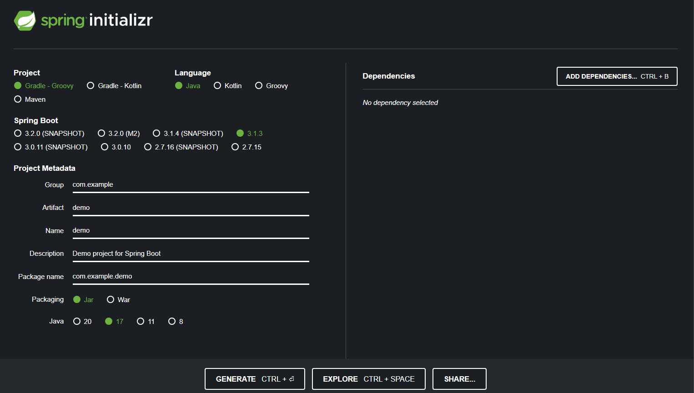
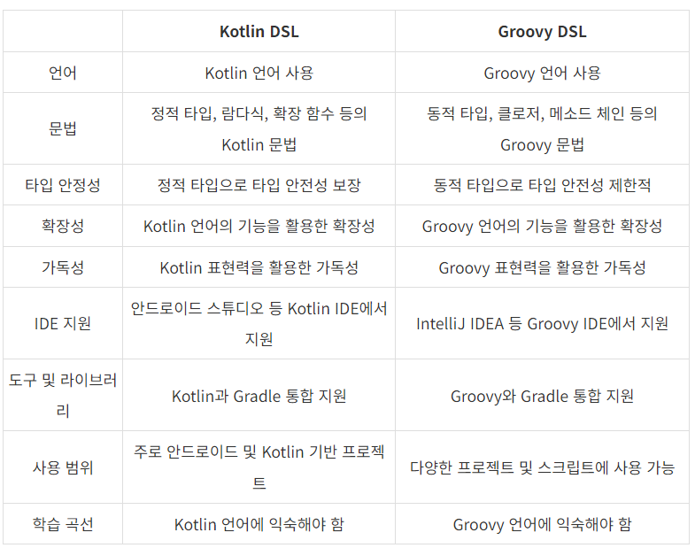 

<참고사이트: [[Java] Gradle, Groovy Gradle, Kotlin Gradle — 일단은 내 이야기](https://kdhyo98.tistory.com/87#Gradle%20%EC%9D%B4%EB%9E%80%3F-1), [Gradle User Manual](https://docs.gradle.org/current/userguide/userguide.html), [Kotlin DSL, Gradle 빌드 기본 언어 채택… 왜 Kotlin DSL일까?](https://blog.imqa.io/kotlin-dsl/), [‘Gradle Kotlin DSL’ 이야기 | 우아한형제들 기술블로그](https://techblog.woowahan.com/2625/)>

**Project**

- Gradle Groovy
  

**Language**

- Java
  

**Spring Boot**

- 원하는 버전, (SNAPSHOT - 만들고 있는 버전, M 시리즈 - 정식 릴리즈되지 않은 버전, 숫자만 있는 버전 - 정식 릴리즈 버전)
  

**Project metadata**

- Group - 보통 기업 도메인 명 (상관없다면 아무거나 적어도 무방)
  
- Artifact - 빌드 되어서 나오는 결과물
  
- Name, Description, Package name - 그대로 두거나 본인이 작성해도 무방
  

**ADD Dependencies...**

- 어떤 라이브러리를 이용할 것인가 정하는 것
  
- 웹 프로젝트라면 Spring web 검색해서 추가


**Generate**

- zip 파일이 다운되고 이를 Intellij에서 import하면 된다. <br><br>


  

Maven 이란

- 프로젝트를 진행하게 되면 많은 라이브러리들을 활용하게 되는데, 사용되는 그 수가 많아지면 이를 관리하는 것이 힘들어진다.
  
- Maven은 내가 사용한 라이브러리뿐만 아니라, 해당 라이브러리가 작동하는데 필요한 다른 라이브러리들까지 관리해서 네트워크를 통해 자동으로 다운 받아준다.
  
- 프로젝트의 전체적인 라이프사이클을 관리하는 도구이다.
  

Gradle 이란

- 기본적으로 빌드 배포 도구(Build Tool)이다.  JAVA, C/C++, Python 등을 지원한다.
  
- Maven은 XML로 라이브러리를 정의하고 활용하나 Gradle의 경우 별도의 빌드스크립트를 통해 사용할 어플리케이션 버전, 라이브러리 등의 항목을 설정할 수 있다.
  
- 장점으로는 스크립트 언어로 구성되어서 XML과 달리 변수 선언, if, else, for등의 로직이 구현가능하여 간결하게 코드 작성이 가능하다.
  

Gradle을 쓰는 이유

레거시 프로젝트, 과거 프로젝트의 경우 Maven으로 남아있는게 있지만, 요즘은 Gradle로 넘어가는 추세이다.<br><br><br>

<p align="center">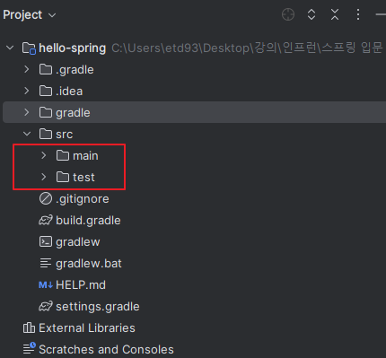</p>

- java 밑에 패키지와 소스파일이 있음
  
- test는 테스트 코드와 관련된 파일들이 들어가 있음
  
  - 요즘 개발 트렌드에서는 테스트코드가 중요하다는 것을 의미
    
- resource 파일은 java 코드 파일을 제외한 xml 이나 설정 파일들이 들어가 있음

## [IntelliJ] Java 버전 바꾸는 법(JDK 버전)
**<u>오류사항 발생</u>**
- No matching variant of org.springframework.boot:spring-boot-gradle-plugin:3.1.3 was found. The consumer was configured to find a library for use during runtime, compatible with Java 8, packaged as a jar, and its dependencies declared externally, as well as attribute 'org.gradle.plugin.api-version' with value '8.2.1' but:

### 1. Project(단축키 Crtl + Shift + Alt + S)
  
  - 스프링 부트 3버전 대부터는 JDK 17부터 지원하기 때문에 jdk 1.8(java8)로 빌드하려고 할 때 발생하는 오류
    
  - SDK 17로 설정
    
  - Language level: SDK default
<p align="center">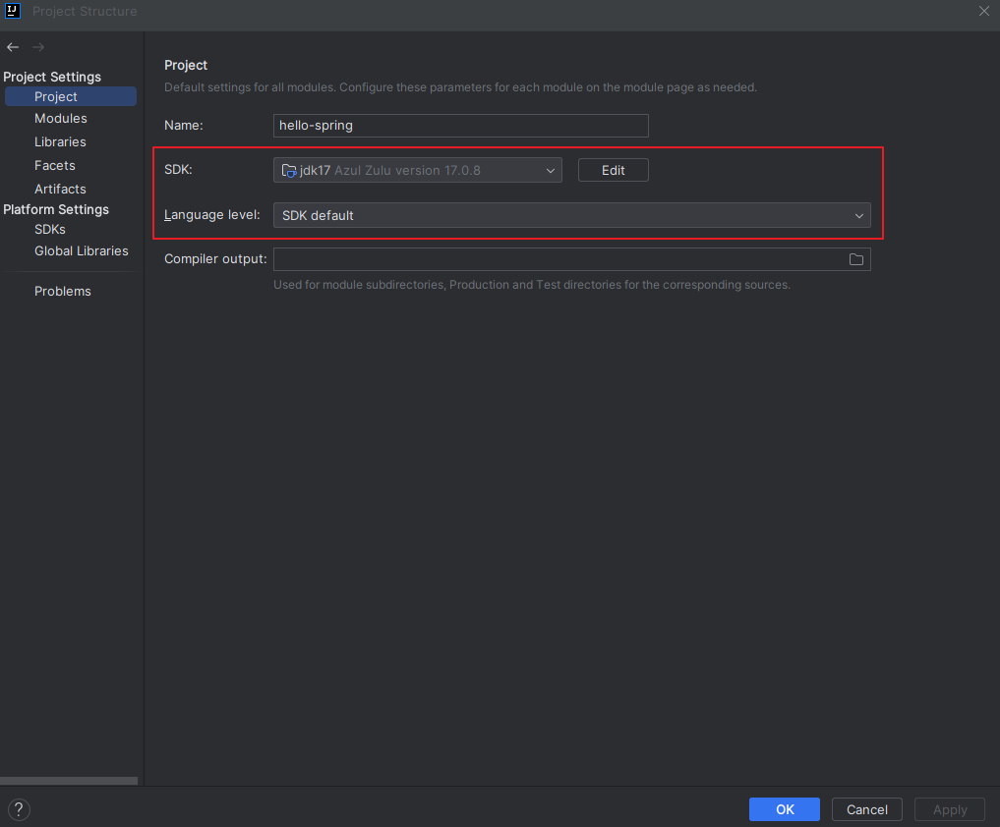</p>
    
### 2. Modules
  
  - Language level 변경
<p align="center">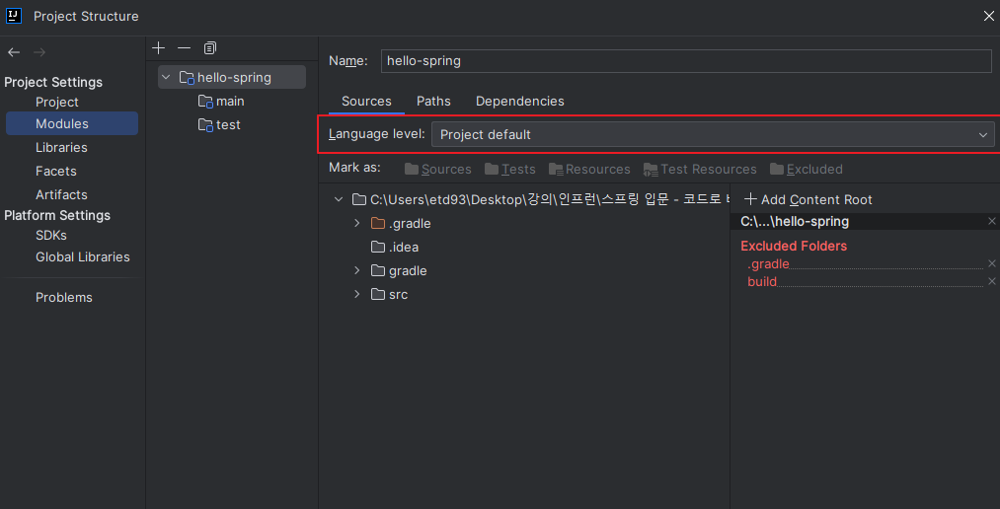</p>
    
### 3. SDKs 설정
  
  - 원하는 JDK 설정  
<p align="center">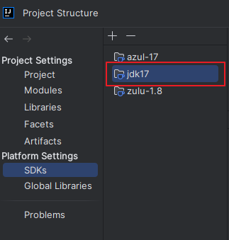</p>
  
### 4. Project Setting (단축키 Ctrl + Alt + S)
  
  - Build,Execution,Deployment  -> Build Tools -> Gradle
    
  - Gradle JVM 변경
<p align="center"></p>
    
  - Build,Execution,Deployment  -> Compiler -> Java Compiler
    
  - Project bytecode version 변경  
<p align="center">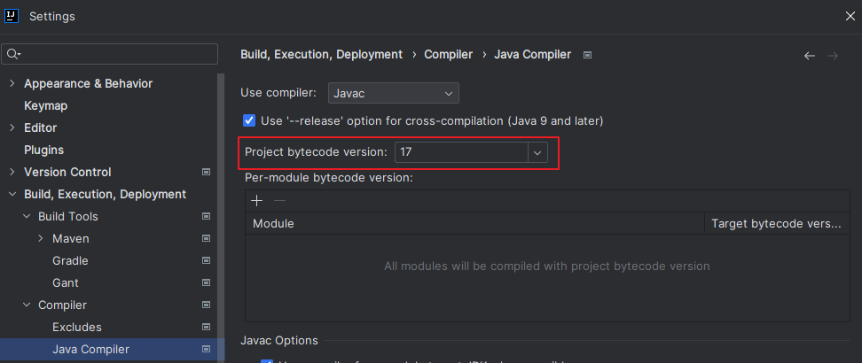</p>
  
### 5. OS JDK 환경변수 설정 다시하기
  
<p align="center">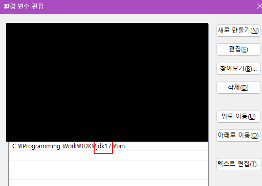</p>
<p align="center">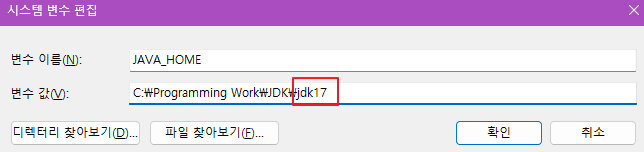</p>
  

## 수행 결과

<p align="center">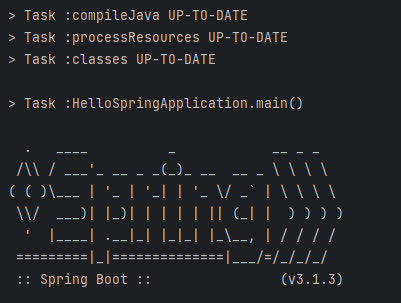</p>

- 여기서,
  
<p align="center">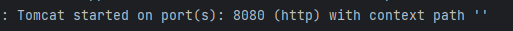</p>
  
<p align="center">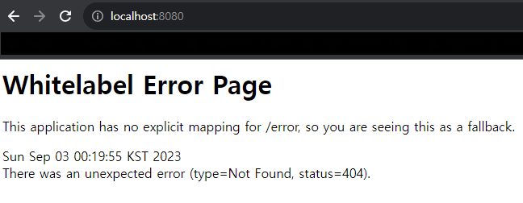</p>
  
<p align="center"></p>
  
  - Stop하면
    
  
<p align="center">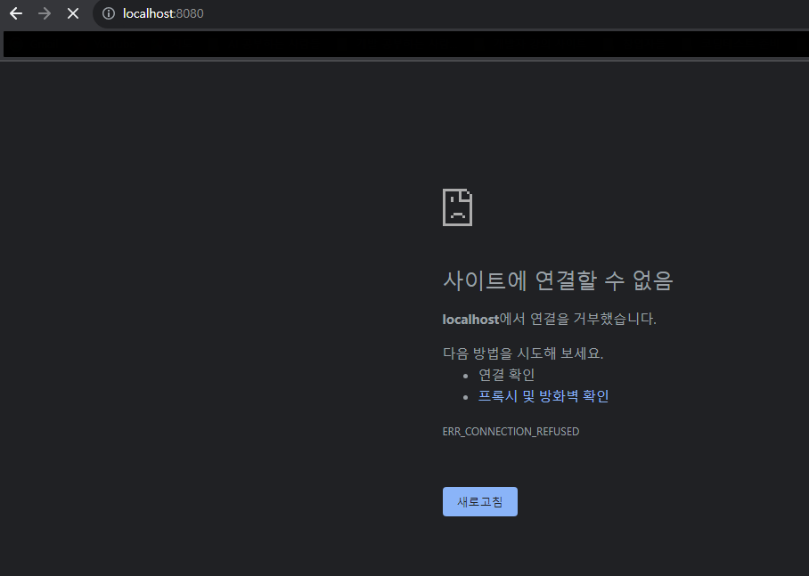</p>
  
- 동작원리
  
   ```java
    @SpringBootApplication
    public class HelloSpringApplication {
    
    	public static void main(String[] args) {
    		SpringApplication.run(HelloSpringApplication.class, args);
    	}
    
    }
   ```
    
  - SpringApplication.run 안에 HelloSpringApplicatin이라는 클래스를 넣어주면 @SpringBootApplication 어노테이션을 통해서 springboot 어플리케이션이 실행이 된다.
    
  - Tomcat을 내장하고 있는데 자체적으로 서버를 띄움
    
- 번외
  
  - 인텔리제이가 자바를 실행하면 직접 실행하는 것이 아니라 Gradle을 통해서 실행하게 되는데 Gradle을 통해서 실행하게 되면 느릴 때가 있음
    
  - Intellij 로 바꾸면 Intellij에서 자바를 바로 실행시켜서 좀 더 빠르다.
 
<p align="center"></p>


## 2. 스프링 웹 개발 기초

## 3. 회원 관리 예제 - 백엔드 개발

## 4. 스프링 빈과 의존관계

## 5. 회원관리 예제 - 웹 MVC 개발

## 6. 스프링 DB 접근 기술

## 7. AOP

