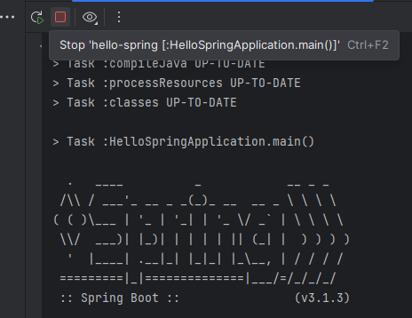
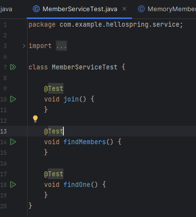

## 출처: 인프런의 [김영한님 강의](https://www.inflearn.com/course/%EC%8A%A4%ED%94%84%EB%A7%81-%EC%9E%85%EB%AC%B8-%EC%8A%A4%ED%94%84%EB%A7%81%EB%B6%80%ED%8A%B8) 를 바탕으로 공부한 것을 기록하는 repo입니다!

# java_springboot_project_practice

<details>
<summary>1. 프로젝트 환경설정 (정리 완)</summary>
<div markdown="1">

## 1. 프로젝트 환경설정 <br>
### 1-1. 프로젝트 생성
spring에서 운영하는 사이트로, spring boot 기반으로 프로젝트를 만들어주는 사이트

[spring initializer](https://start.spring.io/) 
 

<참고사이트: [[Java] Gradle, Groovy Gradle, Kotlin Gradle — 일단은 내 이야기](https://kdhyo98.tistory.com/87#Gradle%20%EC%9D%B4%EB%9E%80%3F-1), [Gradle User Manual](https://docs.gradle.org/current/userguide/userguide.html), [Kotlin DSL, Gradle 빌드 기본 언어 채택… 왜 Kotlin DSL일까?](https://blog.imqa.io/kotlin-dsl/), [‘Gradle Kotlin DSL’ 이야기 | 우아한형제들 기술블로그](https://techblog.woowahan.com/2625/)>

**Project**

- Gradle Groovy
  

**Language**

- Java
  

**Spring Boot**

- 원하는 버전, (SNAPSHOT - 만들고 있는 버전, M 시리즈 - 정식 릴리즈되지 않은 버전, 숫자만 있는 버전 - 정식 릴리즈 버전)
  

**Project metadata**

- Group - 보통 기업 도메인 명 (상관없다면 아무거나 적어도 무방)
  
- Artifact - 빌드 되어서 나오는 결과물
  
- Name, Description, Package name - 그대로 두거나 본인이 작성해도 무방
  

**ADD Dependencies...**

- 어떤 라이브러리를 이용할 것인가 정하는 것
  
- 웹 프로젝트라면 Spring web 검색해서 추가


**Generate**

- zip 파일이 다운되고 이를 Intellij에서 import하면 된다. <br><br>


  

Maven 이란

- 프로젝트를 진행하게 되면 많은 라이브러리들을 활용하게 되는데, 사용되는 그 수가 많아지면 이를 관리하는 것이 힘들어진다.
  
- Maven은 내가 사용한 라이브러리뿐만 아니라, 해당 라이브러리가 작동하는데 필요한 다른 라이브러리들까지 관리해서 네트워크를 통해 자동으로 다운 받아준다.
  
- 프로젝트의 전체적인 라이프사이클을 관리하는 도구이다.
  

Gradle 이란

- 기본적으로 빌드 배포 도구(Build Tool)이다.  JAVA, C/C++, Python 등을 지원한다.
  
- Maven은 XML로 라이브러리를 정의하고 활용하나 Gradle의 경우 별도의 빌드스크립트를 통해 사용할 어플리케이션 버전, 라이브러리 등의 항목을 설정할 수 있다.
  
- 장점으로는 스크립트 언어로 구성되어서 XML과 달리 변수 선언, if, else, for등의 로직이 구현가능하여 간결하게 코드 작성이 가능하다.
  

Gradle을 쓰는 이유

레거시 프로젝트, 과거 프로젝트의 경우 Maven으로 남아있는게 있지만, 요즘은 Gradle로 넘어가는 추세이다.<br><br><br>

<p align="center"></p>

- java 밑에 패키지와 소스파일이 있음
  
- test는 테스트 코드와 관련된 파일들이 들어가 있음
  
  - 요즘 개발 트렌드에서는 테스트코드가 중요하다는 것을 의미
    
- resource 파일은 java 코드 파일을 제외한 xml 이나 설정 파일들이 들어가 있음

## [IntelliJ] Java 버전 바꾸는 법(JDK 버전)
**<u>오류사항 발생</u>**
- No matching variant of org.springframework.boot:spring-boot-gradle-plugin:3.1.3 was found. The consumer was configured to find a library for use during runtime, compatible with Java 8, packaged as a jar, and its dependencies declared externally, as well as attribute 'org.gradle.plugin.api-version' with value '8.2.1' but:

### 1. Project(단축키 Crtl + Shift + Alt + S)
  
  - 스프링 부트 3버전 대부터는 JDK 17부터 지원하기 때문에 jdk 1.8(java8)로 빌드하려고 할 때 발생하는 오류
    
  - SDK 17로 설정
    
  - Language level: SDK default
<p align="center"></p>
    
### 2. Modules
  
  - Language level 변경
<p align="center"></p>
    
### 3. SDKs 설정
  
  - 원하는 JDK 설정  
<p align="center"></p>
  
### 4. Project Setting (단축키 Ctrl + Alt + S)
  
  - Build,Execution,Deployment  -> Build Tools -> Gradle
    
  - Gradle JVM 변경
<p align="center"></p>
    
  - Build,Execution,Deployment  -> Compiler -> Java Compiler
    
  - Project bytecode version 변경  
<p align="center"></p>
  
### 5. OS JDK 환경변수 설정 다시하기
  
<p align="center"></p>
<p align="center"></p>
  

## 수행 결과

<p align="center"></p>

- 여기서,
  
<p align="center"></p>
  
<p align="center"></p>
  
<p align="center"></p>
  
  - Stop하면
    
  
<p align="center"></p>
  
- 동작원리
  
   ```java
    @SpringBootApplication
    public class HelloSpringApplication {
    
    	public static void main(String[] args) {
    		SpringApplication.run(HelloSpringApplication.class, args);
    	}
    
    }
   ```
    
  - SpringApplication.run 안에 HelloSpringApplicatin이라는 클래스를 넣어주면 @SpringBootApplication 어노테이션을 통해서 springboot 어플리케이션이 실행이 된다.
    
  - Tomcat을 내장하고 있는데 자체적으로 서버를 띄움
    
- 번외
  
  - 인텔리제이가 자바를 실행하면 직접 실행하는 것이 아니라 Gradle을 통해서 실행하게 되는데 Gradle을 통해서 실행하게 되면 느릴 때가 있음
    
  - Intellij 로 바꾸면 Intellij에서 자바를 바로 실행시켜서 좀 더 빠르다. (프로젝트를 연습하는 단계에서는 좀 더 편하다)
 
<p align="center"></p>
<br><br>

### 1-2 라이브러리 살펴보기
<br>
<p align="center"></p> <br>
땡겨온 라이브러리 spring-web, thymeleaf는 각각 또다른 라이브러리에 의존하고 있음 <br>
의존하는 라이브러리까지 다 땡겨와서 이용하게 된다. <br>

##### Spring Boot 라이브러리
- spring-boot-starter-web 대표적으로
  
  - spring-boot-server-tomcat
    
  - spring-webmvc
    
- spring-boot-starter-thymeleaf는 html을 렌더링해주는 라이브러리 <br>
<p align="center"></p>
<br>

- spring-boot-starter
  
  - spring-boot
    
  - autoconfigure
    
  - logging
    
  - core 관련한 라이브러리가 들어있음
    
- spring-boot-starter-logging
  
  - logback(실제 log를 어떤 구현체로 실행할 것인지), slf4j(인터페이스)가 들어있다
- log와 관련한 내용
  
  - 현업에 있는 개발자들은 System.out.println으로 거의 출력하지 않는다.
    
  - log로 출력을 해야 한다.
    
  - log로 남겨야 심각한 에러들을 따로 파일로 모아서 관리가 가능하기 때문
    
  - 취준이나 신입들은 log를 왜 쓰지라고 생각할 수 있음.
    
- spring-boot-starter-test
  
  - junit (테스트 프레임워크)
    
  - mockito (mock 라이브러리)
    
  - assertj (테스트 코드 편하게 작성하게 도와주는 라이브러리)
    
  - spring-test (스프링 통합 테스트)
  <br><br>
  
  ### 1-3 View 환경설정
  <br>
  <p align="center"></p>
  <br>
  
  [spring-boot-docs](https://docs.spring.io/spring-boot/docs/current/reference/htmlsingle/#web.servlet.spring-mvc.welcome-page) 공식문서에서 내용을 찾을 수 있음

- main/resources/static 폴더 내에 index.html 파일을 만들어서 넣으면 Welcome page 기능을 제공한다.
  
<br>

- ```html
  <!DOCTYPE HTML>
  <html>
  <head>
      <title>Hello</title>
      <meta http-equiv="Content=Type" content="text/html; charset=UTF-8" />
  </head>
  <body>
  Hello
  <a href = "/hello">hello</a>
  </body>
  </html>
  ```
  <br>
  
- 단순히 파일을 서버에 던져준 것 밖에 안됨
  
- 템플릿 엔진이라는 것을 쓰면 모양을 바꿀 수 있다.
  
- 공식 사이트
  
  - [thymeleaf.org](https://www.thymeleaf.org/)
    
  - [스프링 공식 튜토리얼](https://spring.io/guides/gs/serving-web-content/)
    
  - [스프링 부트 메뉴얼](https://docs.spring.io/spring-boot/docs/current/reference/htmlsingle/)
    

- spring-boot-starter-thymeleaf가 위 html 파일을 꾸며주는 역할
  
- spring boot 메뉴얼 사이트에서도 지원하는 기능으로 thymeleaf가 있는 것을 확인할 수 있다.
<br>
<p align="center"></p>
<br>

```java
pacakage hello.hellospring;

import...

@SpringBootApplication
public class HelloSpringApplication{
    pubilc static void main(String[] args){
        SpringApplication.run(HelloSpringApplication.class, args);
    }
}
```
<br>

##### 화면 구성을 위한 작업

- Web Application에서 첫 진입이 Controller
  
- controller 패키지를 만든다.
  
- HelloController 클래스 파일을 만든다.

<br>
<p align="center"></p>
<br>

```java
import org.springframework.stereotype.Controller;
import org.springframework.ui.Model;
import org.springframework.web.bind.annotation.GetMapping;

@Controller
public class HelloController {
      // Web application에서 /hello 라고 입력값이 들어오면
      // @GetMapping 부분이 호출이 된다.
    @GetMapping("hello")
    public String hello(Model model){
        model.addAttribute("value", "welcome!!");
        return "hello";

    }
}
```
<br>

- Web application에서 /hello라고 입력값이 들어오면

```java
    @GetMapping("hello")
    public String hello(Model model){
        model.addAttribute("value", "welcome!!");
        return "hello";
```
<br>

- 위 코드 부분을 호출해준다.
  
- model은 MVC에서의 M에 해당
  
- Model 객체는 Controller에서 생성된 데이터를 View로 전달할 때 사용한다.

```html
<!DOCTYPE HTML>
<html xmlns:th="http://www.thymeleaf.org">
<head>
    <title>Hello</title>
    <meta http-equiv="Content-Type" content="text/html; charset = UTF-8"/>

</head>
<body>
<p th:text="'HELLO!!' + ${value}">처음이시군요. 고객님</p>
</body>
</html>
```
<br>

- 위 value값에 "welcome!!"이 들어가서 홈페이지에 <br>

<p align="center"></p>

- 위 그림처럼 뜨게 된다. <br><br>

##### 전체 과정 설명 <br>

<p align="center"></p> <br>

- 웹 브라우저가 localhost:8080에서 /hello를 스프링 부트쪽으로 던지게 되면 내장된 Tomcat server가 spring에게 다시 보내고
  
- spring은 HelloController를 찾은 뒤 이 내부에 <br>

```java
@Controller
public class HelloController {
      // Web application에서 /hello 라고 입력값이 들어오면
      // @GetMapping 부분이 호출이 된다.
    @GetMapping("hello")
    public String hello(Model model){
        model.addAttribute("value", "welcome!!");
        return "hello";

    }
}
```
<br>

- @GetMapping(get, post 에서의 get을 의미)의 "hello"와 매칭되게 됨
  
- 그러면 HelloController 내의 @GetMapping이 선언된 hello 라는 메서드가 실행된다.
  
- spring이 model을 만들어서 넘겨주는데 model에 "value"와 "welcome!!"을 담아서 view로 넘겨주게 된다
  
- return "hello";
<br>

<p align="center"></p> <br>

- hello.html로 model을 넘기는 것
  
- spring boot는 return "hello"; 하게 되면
  
- viewResolver에 의해서
  
- resource/templates 내의 hello를 찾게 된다.
  
- hello.html을 찾아서 랜더링한다.
  
- 요약: 컨트롤러에서 리턴 값으로 문자를 반환하면 'viewResolver'가 화면을 찾아서 처리한다.
  
  - spring boot 템플릿엔진 기본 viewName 매핑
    
  - `resources:template/` + {viewName} + `.html`
    
- 참고사항
  
  - `spring-boot-devtools` 라이브러리를 추가하면 `html` 파일을 컴파일만 해주면 서버 재시작 없이 view 파일 변경이 가능하다.
 
</div>
</details>
  
<details>
<summary>2. 스프링 웹 개발 기초 (정리 완)</summary>
<div markdown="1">

## 2. 스프링 웹 개발 기초 <br>
  
크게 3가지 방법이 있음

- 정적 컨텐츠
  
  - 파일 자체를 웹 브라우저에 전달(서버에서 가공하지 않고 파일 전달)
    
  - 클라이언트의 요청을 받으면 서버에 미리 저장된 HTML, CSS, JS 등의 파일을 그대로 보여주는 것
    
  - 미리 저장된 파일을 그대로 보여주기 때문에 클라이언트들의 요청에 대해 동인한 결과를 보여준다.
    
- MVC 템플릿 엔진 (Model, View, Controller)
  
  - 서버에서 동적으로 HTML을 변환하여 웹 브라우저로 보내주는 역할
    
  - Model: 어플리케이션이 무엇을 할 것인지
    
  - View: 화면에 보여주기 위한
    
  - Controller: 모델이 어떻게 처리할지
    
- API
  
  - JSON과 같은 데이터 구조 포맷으로 클라이언트들에게 전달하는 방식, 화면은 클라이언트쪽에서 그린다.
    
  - 서버끼리는 html 필요없이 데이터만 주고 받으면 됨. 서버끼리 통신할 때 사용함
    
  - view 없이 그대로 http body에 전달하는 방식 <br>

  #### 2-1 정적 컨텐츠

- HTML 작성
  
  - spring boot는 정적 컨텐츠 기능을 제공한다. `/main/resources/static` 하위 폴더에 `hello-static.html` 파일을 생성하고 간단하게 살펴보기 위해서 아래 코드처럼 작성해본다.
    
    `hello-static.html`
    
    ```html
    <!DOCTYPE HTML>
    <html>
    <head>
        <title>static content</title>
        <meta http-equiv="Content-Type" content="text/html; charset=UTF-8" />
    
    </head>
    <body>
    정적 컨텐츠입니다.
    </body>
    </html>
    ```
    
- 클라이언트로부터 `localhost:8080/hello-static.html` 요청이 스프링 부트로 들어가게 되면 Tomcat 서버를 거치고 컨트롤러에서 `hello-static` 에 매핑하는 컨트롤러가 있는지 우선 확인한다.
  
- 즉, `hello-static` 관련 컨트롤러를 찾음.
  
- 동작이 없을 경우 `/resources/static` 하위에서 해당하는 파일을 찾아서 보내준다. <br>

#### 2-2 동적 컨텐츠
##### 2-2-1 MVC와 템플릿 엔진을 이용한 웹 개발 <br>

- MVC 라는 건 Model, View, Controller를 의미
  
- 과거에는 Controller와 View가 따로 분리되어 있지 않았음
  
- View에서 다 했음 (모델 1 방식)
  
- Model, View, Controller로 나누는 것이 일반적
  
- 위에서 만들었던 HelloController.java 파일에 추가를 해보자 (1-3 View 환경설정에서 헀음)
  
  ```java
  package com.example.hellospring.controller;
  
  import org.springframework.stereotype.Controller;
  import org.springframework.ui.Model;
  import org.springframework.web.bind.annotation.GetMapping;
  
  @Controller
  public class HelloController {
      @GetMapping("hello")
      public String hello(Model model){
          model.addAttribute("value", "welcome!!");
          return "hello";
  
      }
  
      // 추가된 부
      @GetMapping("hello-mvc")
      // @RequestParam 외부에서 값을 받겠다.
      // Model에 담으면 view에서 렌더링할 때 쓸 것
      public String helloMvc(@RequestParam("name") String name, Model model){ // 웹사이트 url을 바꿔서 값을 얻겠다.
          model.addAttribute("name", name); // "name" 이라는 key 값에 name value값을 model에 담는다.
          return "hello-template";
      }
  }
  ```
  
- `@RequesParam`: 외부에서 값을 받아서 View로 값을 넘겨준다.
  
  - `@RequestParam`("가져올 데이터의 이름") [데이터타입] [가져온데이터를 담을 변수]
- 여기서는 "name"이라는 String 타입 값을 받아서 Model 객체에 넣고, Model 객체를 View로 넘겨준다.
  
- 넘겨주는 html은 `hello-template.html` 이다.
  
- 그럼, `hello-template.html`을 만들고 간단하게 코드를 작성해보자
  

```html
<!DOCTYPE HTML>
<html xmlns:th="http://www.thymeleaf.org">
<body>
<p th:text="'HELLO!!' + ${name}">hello! client</p>
</body>
</html>
```

- `<p>`의 hello! client는 name값이 존재하게 되면 `HELLO!! {name}`으로 치환되게 된다.
  
- 이제 `http://localhost:8080/hello-mvc` 에 들어가보면 <br>

<p align="center"></p> <br>

- 에러가 뜨는 것을 확인할 수 있다. <br>

<p align="center"></p> <br>

<p align="center"></p> <br>

<p align="center"></p> <br>

- default가 true이며, 이는 넘어온 값이 존재해야 한다는 것을 의미
  
- 넘어온 name 값이 없어서 에러가 발생한 것
  
- 그러면 url 상에서 값을 넘겨줘보자 <br>

<p align="center"></p> <br>

<p align="center"></p> <br>

<p align="center"></p> <br>

- 페이지 소스 보기를 하면 이미지

<p align="center"></p> <br>

- HTML로 이루어진 것을 확인할 수 있다.
  
- `String name= spring!!!!!` 이 되고
  
- `model.addAttribute("name", name);` 에 의해 model에 담겨서 템플릿에 넘겨준다.
  
- `<p th:text="'HELLO!!' + ${name}">hello! client</p>` 에서 model의 key값인 name의 value 값을 받아서 `hello! client` 대신해서 `'HELLO!!' spring!!!!!`을 출력하게 된다.
  
- 정적 컨텐츠와는 다르게 HTML로 변환 후 웹 브라우저에 넘겨준다. <br>

##### 2-2-2 API 방식

１。이전에 만들었던 HelloController.java에 코드를 추가해보자

```java
    @GetMapping("hello-string")
    @ResponseBody // html의 body 태그가 아닌 http에서 header와 body 부분에서 body부분에 데이터를 직접 넣어주겠다.
    public String helloString(@RequestParam("name") String name){
        return "hello" + name;
    }
```

- 이전 템플릿 엔진과이 차이는 view가 없고 데이터 그대로 출력한다.
  
- 위에서 한 것처럼 페이지 소스보기를 하면 <br>

<p align="center"></p> <br>

- HTML이 아니라 데이터 그대로를 출력한 것을 확인할 수 있다. <br>

２。이전에 만들었던 HelloController.java에 코드를 추가해보자 <br>

```java
    @GetMapping("hello-api")
    @ResponseBody
    public Hello helloApi(@RequestParam("name") String name) {
        Hello hello = new Hello();
        hello.setName(name);
        return hello;
    }


    static class Hello{
        private String name;

        public String getName() {
            return name;
        }

        public void setName(String name) {
            this.name = name;
        }
    }
```
<br>

- Hello 타입의 hello 객체를 만들어서 입력 받은 name 값을 hello 객체에 넣어준다.
  
- 아까와 다르게 문자열이 아니라 객체를 return으로 넣어준다면? <br>

<p align="center"></p> <br>

- HTML이 아닌 데이터를 웹 브라우저로 보냈으며, JSON 형식으로 보낸 것을 확인할 수 있다. <br>

2-1. 동작 원리

<p align="center"></p> <br>

- @ResonseBody가 없다면
  
  - viewResolver가 템플릿을 찾고 HTML로 변환 후 웹 브라우저에 보냈음
- @ResponseBody를 사용한다면
  
  - 데이터를 그대로 넘기게 됨.
    
  - 문자라면 그대로 넘기는데 객체라면?
    
  - 객체라면 JSON 형식으로 반환해서 HTTP 응답으로 반환한다.
    
  - HTTP의 BODY 에 문자 내용을 직접 반환
    
  - `viewResolver` 대신에 `HttpMessageConverter` 가 동작한다.
    
  - 기본 문자처리: `StringHttpMessageConverter`
    
  - 기본 객체처리: `MappingJackson2HttpMessageConverter`
    
  - byte 처리 등등 기타 여러 HttpMessageConverter가 기본으로 등록되어 <br>

### 요약

- 정적 컨텐츠: 파일 그대로를 웹 브라우저에 보내는 방식
  
- 동적 컨텐츠
  
  - MVC 방식: HTML로 변환 후 웹 브라우저에 보내는 방식
    
  - API 방식: 데이터로 변환 후 웹 브라우저에 보내는 방식
    

```java
    static class Hello{
        private String name;

        public String getName() {
            return name;
        }

        public void setName(String name) {
            this.name = name
      }
```

- Getter Setter 개념
  
  - private으로 접근 못하게 하고
    
  - 외부에서 접근하려면 getName, setName으로 접근하게끔 하는 것
    
  - 이를 java bean 표준 방식이라고 한다.
    
  - 또 다른 용어로 property 접근 방식이라고 한다.
  


</div>
</details>

<details>
<summary>3. 회원 관리 예제 - 백엔드 개발 (정리 완)</summary>
<div markdown="1">

## 3. 회원 관리 예제 - 백엔드 개발 <br>

##### 3-1. 비즈니스 요구사항 정리  <br>

```
- 비즈니스 요구 사항 정리

- 회원 도메인

- 회원 도메인을 저장하고 불러올 수 있는 repository 객체 만들기

- 만든 repository가 정상 동작하는지 테스트하는 테스트 케이스 작성
```

비즈니스 요구사항 정리 (간단한 비즈니스)

- 데이터: 회원 ID, 이름
  
- 기능: 회원 등록, 조회
  
- 가정한 상황 : 개발자가 개발해야 하는 시점에 데이터 저장소가 선정되지 않았음

<p align="center"></p> <br>

#### 3-2. 회원 domain과 repository 만들기

1. domain 폴더 만들고 그 안에 Member 클래스 만들기

```java
package hello.hellospring.domain;

public class Member{

    private Long id;
    private String name;

    public Long getId(){
        return id;
    }
    public void setId(Long id){
        this.id = id;
    }
    public String getName(){
        return name;
    }
    public void setName(String name){
        this.name =  name;
    }
}
```

- 고객이 정하는 아이디가 아니라 데이터를 구분하기 위한 시스템이 정하는 아이디
  
- getter, setter 만들기
  

2. 회원 객체를 담을 리포지토리 만들기 (repository 폴더 만들기)
  
  2-1. MemberRepository 라는 interface 만들기

<p align="center"></p> <br>

```java
package hello.hellospring.repository;

import hello.hellospring.domain.Member;

public interface MemberRepository{
    Member save(Member member);
    Optional<Member> findById(Long id);
    Optional<Member> findByName(String name);
    List<Member> findAll();
}
```

- save 하면 저장된 회원 정보가 반환이 된다.
  
- Optional 이란 (java 8에 들어간 기능)
  
  - findById 나 findByName의 반환값이 null 일 수 있는데 이 null 값을 Optional로 감싸서 처리하는 것(다음 수업에 배울 것).
 
- interface 동작원리
  
  - save를 통해 회원 정보 저장소에 저장한다.
    
  - findById, findByName을 통해서 회원의 정보를 찾는다.
    
  - findAll을 통해서 모든 회원 정보 반환한다.
    

3. MemoryMemberRepository 구현체 만들기

```java
// 전체 코드

public class MemoryMemberRepository implements MemberRepository {

    // 저장할 곳 선언
    private static Map<Long, Member> store = new HashMap<>();
    private static long sequence = 0L; // 0 1 2... key값을 생성하는 것 


    // 1번
    @Override
    public Member save(Member member){
    member.setId(++sequence); // id 설정한다. 
    store.put(member.getId(), member); // 그 후 stored 한다.
    return member; // 저장된 값을 반환해준다. 이렇게 감싸서 null이라도 넘겨주면
    // 클라이언트쪽에서 뭐라도 할 수 있음    
    }


    // 2번
    @Override
    public Optional<Member> findById(Long id){
        // null이 반환될 것 같으면 Optional로 감싼다.
        return Optional.ofNullable(store.get(id)); // store에서 id값을 가져온다.
    }


    // 3번
    @Override
    public Optional<Member> findByName(String name){
        return store.values().stream()
                .filter(member -> member.getName().equals(name))
                .findAny();
    }

    // 4번
    @Override
    public List<Member> findAll() {
        return null;
    }

}
```

- 저장을 어딘가 해야 함
  
  - Map을 이용했음
    
  - 현업에서는 변수를 공유할 경우 동시성 문제 때문에 `HashMap`이 아닌  `ConcurrnetHashMap`을 사용하지만 지금처럼 간단한 프로젝트는 그냥 `HashMap` 사용함
    
  - long 또한 동시성 문제 때문에 현업에서는 `AtomicLong`을 쓴다. 마찬가지로, 간단한 예제이므로 그냥 `long` 사용함
    
- store에다가 넣기 전에 member의 id값을 세팅해준다.
  
  ```java
      private Long id; //시스템이 정해주는 값
      private String name; // 사용자가 기입한 값
  ```
  
- store에 저장하면 그 값을 반환한다.
  

```java
    // 2번
    // 이렇게 코드를 작성하면 만약 null 값이 반환된다면?
    // 클라이언트쪽에서는 아무것도 못함
    @Override
    public Optional<Member> findById(Long id){
        // null이 반환될 것 같으면 Optional로 감싼다.
        return store.get(id); // store에서 id값을 가져온다.
    }

==>   
    @Override
    public Optional<Member> findById(Long id){
        // null이 반환될 것 같으면 Optional로 감싼다.
        return Optional.ofNullable(store.get(id)); // store에서 id값을 가져온다.
    }
```

```java
    // 3번

    @Override
    public Optional<Member> findByName(String name){
        return store.values().stream()
                .filter(member -> member.getName().equals(name))
                .findAny();
    }
```

- stream()을 통해 컬렉션에 들어있는 elements들을 순회하면서
  
- member의 getName과 parameter로 입력된 name 값이 같은지 판단한다.
  
- 같은 경우에만 filter 되고 이를 반환한다.
  
- findAny는 stream에서 가장 먼저 탐색되는 element를 return
  
- return값은 Optional로 반환이 된다.
  
- 끝까지 찾았는데 없다면 Optional에 null이 들어가서 반환된다.
  

```java
    // 4번
    @Override
    public List<Member> findAll() {
        return new ArrayList<>(store.values();
    }
```

- store에 담겨있는 것들은 member들이며 member들이 반환된다.

##### 3-3. Repository 테스트 케이스 작성 및 검증

##### 다 작성했는데 어떻게 검증할까?

=> 테스트 케이스를 작성해서 검증한다.

검증은

- 자바의 main 메서드를 통해 실행하거나
  
- 웹 어플리케이션의 컨트롤러를 통해 해당 기능을 실행해서 검증가능하다.
  
- 반복 실행하기 어렵고, 여러 테스트를 한번에 실행하기 어렵다.
  

=> JUnit 이라는 프레임워크를 통해 문제를 해결함

<p align="center"></p> <br>

```java
package com.example.hellospring.repository;

import com.example.hellospring.domain.Member;
import org.junit.jupiter.api.Assertions;
import org.junit.jupiter.api.Test;

public class MemoryMemberRepositoryTest { // 굳이 public 할 필요는 없음

    MemberRepository repository = new MemoryMemberRepository();

    @Test
    public void save(){
        Member member = new Member();
        member.setName("spring");

        repository.save(member);

        Member result = repository.findById(member.getId()).get();
        Assertions.assertEquals(member, result);
    }
}
```

<p align="center"></p> <br>

- 내가 짠 코드가 제대로 동작하는지 체크하기 위해서
  
- 새로 만든 객체 member에 "spring"이라는 name값을 넣어주고
  
- DataBase에 저장한 result의 값이 새로 만든 member와 같은지 확인한다.
  
- 즉, 새로 만든 객체와 그 객체를 DB에 저장하고 꺼낸 객체가 같은지 확인하는 것.
  
- 여기서, Assertions 기능을 사용한다.
  

```java
// org.junit.jupiter.api의 Assertions를 사용하면
Assertions.assertEquals(expected, actual);

// org.assertj.core.api의 경우
Assertions.assertThat(expected).isEqualTo(actual);
```

- expected(기대하는 값: 내가 저장소에 저장한 값이 member니까 member가 튀어나오겠지)
  
- actual(실제 값: 저장한 값을 꺼냈을 때 그 값)
  
- 아무 문제 없으면 아래 그림처럼 녹색불 뜬다.

<p align="center"></p> <br>

##### Assertions.assertEquals(expected, actual);

[참고사이트](https://stackoverflow.com/questions/26102865/assertequals-what-is-actual-and-what-is-expected)

- JUnit 프레임워크 Assertions.assertEquals(expected, actual)
  
- TestNG 프레임워크 Assertions.assertEquals(actual, expected)
  
- 어떤 테스트 프레임워크를 사용하냐에 따라 값의 순서가 달라서 헷갈릴 수 있다.
  
- 물론, 결과값이 true일 경우 문제가 되지 않는다.
  
- 하지만, 테스트 결과값이 false일 경우 (예: JUnit)
  
- 실제로는 expected(예상한 값)은 맞았고 actual이 틀렸지만
  
- expected가 false의 원인이라고 반대로 말하기 때문
  
- 그래서, 직관적으로 알기 쉬운
  
- Assertions.assertThat(expected).isEqualTo(actual); 가 나을 수 있다.
  
- 아래 그림이 JUnit에서 반대로 넣을 경우
  
- <u>각 테스트 프레임워크의 convention을 잘 따르자!</u>

<p align="center"></p> <br>

<p align="center"></p> <br>


```java
package com.example.hellospring.repository;

import com.example.hellospring.domain.Member;
//import org.junit.jupiter.api.Assertions;
import org.assertj.core.api.Assertions;
import org.junit.jupiter.api.Test;

import java.util.List;

import static org.assertj.core.api.Assertions.*;

public class MemoryMemberRepositoryTest { // 굳이 public 할 필요는 없음

    MemberRepository repository = new MemoryMemberRepository();

    @Test
    public void save(){
        Member member = new Member();
        member.setName("spring");

        repository.save(member);

        Member result = repository.findById(member.getId()).get();
        Assertions.assertThat(result).isEqualTo(member);
    }

    @Test
    public void findByName(){
        Member member1 = new Member();
        member1.setName("spring1");
        repository.save(member1);

        Member member2 = new Member();
        member2.setName("spring2");
        repository.save(member2);

        Member result = repository.findByName("spring1").get();
        Assertions.assertThat(result).isEqualTo(member1);
    }

    @Test
    public void findAll(){
        Member member1 = new Member();
        member1.setName("spring1");
        repository.save(member1);

        Member member2 = new Member();
        member2.setName("spring2");
        repository.save(member2);

        List<Member> result = repository.findAll();
        Assertions.assertThat(result.size()).isEqualTo(3);
    }

}
```

- findByName()까지 test했을 때 문제없었는데 findAll()을 넣고 test 돌렸더니 에러가 발생

<p align="center"></p> <br>

- 왜일까?
  
- 테스트의 순서는 보장이 되지 않는다.
  
- 순서에 의존적으로 설계해서는 안된다.
  
- 즉, 순서 상관없이 메서드별로 따로 동작하도록 설계를 해야 한다.
  
- 위에서 보는 것처럼 findAll()이 먼저 실행이 되고 repository에 member1 객체가 저장이 된다.
  
- 그 다음 findByName() 메서드를 수행하는데 member1의 새로운 객체가 또 생성이 된다.
  
- 그러나, 이름이 "spring1"로 같기 때문에 이전의 member1 객체를 불러서 false가 된 것. **<u>다른 객체가 나온 것</u>**
  

##### 하나의 메서드에 대한 테스트가 끝나면 저장소 데이터를 CLEAR 시키자

```java
// test 폴더의 MemoryMemberRepositoryTest.java
    // interface를 테스트하는 것이 아니므로 MemoryMemberRepository로 바꾼다.
    MemoryMemberRepository repository = new MemoryMemberRepository();


    // Test 메서드가 끝날 때마다 수행하는 @AfterEach 선언    
    @AfterEach
    public void aterEach(){
        repository.clearStore();
    }
// main 폴더의 MemoryMemberRepository.java 
    // 맨 밑에 추
    public void clearStore(){
        store.clear();
    }
```

- 각 Test 메서드가 끝날 때마다 수행하는 @AfterEach 선언한다.
  
- interface를 테스트하는 것이 아니므로 MemoryMemberRepository로 바꾼다.
  
- Test 메서드가 끝날 때마다 repository를 지운다.
  

##### 다시 테스트 시킨 결과

<p align="center"></p> <br>

##### 테스트만 해도 굉장히 깊은 내용

- 지금 한 것은 개발을 진행한 뒤 Test 케이스(여기서는 MemoryMemberRepository)를 작성했음
  
- 이 방식을 뒤집어서 Test 케이스를 작성한 뒤에 개발을 시작할 수 있다.
  
- 이를 TDD (Test-Driven Development) 라고 한다.
  
- 나는 세모 모양 결과물을 만들고 싶다
  
- 그럼 세모 모양 결과물을 만들기 시작하는 것이 아니라
  
- 세모 모양 틀(테스트)을 먼저 만들어놓고 이 틀에 내 결과물을 끼워넣어서 테스트를 하는 것
  

##### 번외: 여러 Test를 했는데 결과창에 하나만 나온다면?

<p align="center"></p> <br>

- File - settings - Preferences - Build, Execution, Deployment - Build Tools - Gradle 이동
  
- Run tests using의 속성을 Intellij IDEA로 변경해주고 apply

<p align="center"></p> <br>

<p align="center"></p> <br>

- 맞게 나온다!

##### 3-4. 서비스 개발

- service 폴더 만들기, 폴더 안에 MemberService 클래스 만들기
  
- 기존에 만들었던 저장소 가져오기
  
- 회원 가입 만들기
  

```java
    private final MemberRepository memberRepository = new MemoryMemberRepository();

    /* 회원가입 */
    public Long join(Member member){
        // 같은 이름이 있는 중복 회원 X
        Optional<Member> result = memberRepository.findByName(member.getName());
        result.ifPresent(m ->{
            throw new IllegalStateException("이미 존재하는 회원입니다.");
        });

        memberRepository.save(member); //
        return member.getId(); // 단순히 id만 반환해보자
    }
```

- 이미 값이 존재하면 throw new 한다.
  
  - 반환된 값이 Optional이기 때문에 가능한 것
    
  - Optional로 안하면 `if null이 아니면`이라고 구현했을 것
    
  - Optional로 감싸면 이 안에 Member 객체가 있다.
    
  - 그러면 Optional의 여러 메서드를 사용할 수 있다.
    
  - Optional을 사용해서 `ifPresent`를 사용할 수 있음.
    
  - `Member member1 = result.get();`
    
    - 이렇게 쓸 수 있지만 직접 꺼내는 것을 권장하지는 않음.
   
<p align="center"></p> <br>

  - `orElseGet` 메서드를 통해서 값이 있으면 가져오지만 값이 없다면 없을 경우에 대해 대응 방법이 구현가능하다.
    
- 코드의 가독성을 위해 아래처럼 바꿀 수 있다.
  

```java
        Optional<Member> result = memberRepository.findByName(member.getName());
        result.ifPresent(m ->{
            throw new IllegalStateException("이미 존재하는 회원입니다.");
        });

        ==> 첫줄 result와 둘째줄 result를 묶는 느낌이다.

        memberRepository.findByName(member.getName());
                .ifPresent(m ->{
                throw new IllegalStateException("이미 존재하는 회원입니다.");
                });
```

- Extract Method: 한 메서드에 세세한 처리가 많을 때 그런 처리를 묶어서 나누고 독립된 메서드로 추출하는 것
  
- Intellij 단축키 : `crtl` + `alt` + `m`
  
  - 만약 단축키가 안먹힌다면 Geforce Experience 게임 내 오버레이 해제
    
  - 또는 다른 프로그램에서 해당 단축키를 사용하는지 확인해볼 것

```java
    public Long join(Member member){

        validateDuplicateMember(member); // 중복 회원 검사

        memberRepository.save(member); 
        return member.getId(); 
    }

     private void validateDuplicateMember(Member member) {
     memberRepository.findByName(member.getName())
             .ifPresent(m ->{
                 throw new IllegalStateException("이미 존재하는 회원입니다.");
             });
    }
```

##### 전체 코드

```java
package com.example.hellospring.service;

import com.example.hellospring.domain.Member;
import com.example.hellospring.repository.MemberRepository;
import com.example.hellospring.repository.MemoryMemberRepository;

import java.util.List;
import java.util.Optional;

public class MemberService {

    private final MemberRepository memberRepository = new MemoryMemberRepository();

    /* 회원가입 */
    public Long join(Member member){
        // 같은 이름이 있는 중복 회원 X
//        Optional<Member> result = memberRepository.findByName(member.getName());
//        result.ifPresent(m ->{
//            throw new IllegalStateException("이미 존재하는 회원입니다.");
//        });

        validateDuplicateMember(member);

        memberRepository.save(member); //
        return member.getId(); // 단순히 id만 반환해보자
    }

    private void validateDuplicateMember(Member member) {
        memberRepository.findByName(member.getName())
                .ifPresent(m ->{
                    throw new IllegalStateException("이미 존재하는 회원입니다.");
                });
    }

    /*전체 회원 조회*/
    public List<Member> findMembers(){
        return memberRepository.findAll();
    }

    public Optional<Member> findOne(Long memeberId){
        return memberRepository.findById((memeberId));
    }

}
```

- 중복 회원 검사는 제대로 하는지, 오류가 발생했을 때 오류메세지는 잘 띄우는지 테스트해봐야 한다.

##### Optional에 대한 Tip [참고사이트: 망나니개발자](https://mangkyu.tistory.com/203)

- 연습하는 단계이므로 위 프로젝트는 그냥 진행함. 하지만,
- Optional을 바로 반환하는 것은 좋지 못하다.
- 깊게 배우고 싶다면 위 사이트나 이펙티브 자바 책을 살펴볼 것


Optional 만들어진 의도 및 올바른 사용법

- 만들어진 이유
  
  - null을 반환하면 오류가 발생할 가능성이 매우 높은 경우에 오류를 발생시키지 않고 메소드의 반환 타입으로 사용되도록 설계되었음.
- 장점
  
  - 코드가 `Null - safe` 해진다.
    
  - 가독성이 좋아진다.
    
  - 어플리케이션이 안정적이게 된다.
    
  - 위 장점은 제대로 사용했을 때 경우임
    
- 제대로 쓰지 않으면 위험하다
  
  - NullPointerException 대신 NoSuchElementException이 발생할 수 있음
    
    - 값이 있는지 판단하지 않고 쓴다면 NSEE가 발생
  - 이전에 발생하지 않았던 문제가 발생함
    
    - 문제가 되는 대표적인 경우가 직렬화(Serialize)를 할 때
      
    - Optional은 직렬화를 지원하지 않음
      
    - 캐시나 메세지큐 등과 연동할 때 문제 발생할 수 있음
      
  - 코드의 가독성을 떨어뜨림
    
    - Optional을 쓰기 위해 값의 유무 검사를 여러 번 할 수도 있다.
  - 시간적, 공간적 비용이 증가함
    
    - 공간적 비용: Optional은 객체를 감싸는 컨테이너이므로 Optional 객체 자체를 저장하기 위한 메모리가 추가로 필요하다.
      
    - 시간적 비용: Optional 안에 있는 객체를 얻기 위해서는 Optional 객체를 통해 접근해야 하므로 접근 비용이 증가한다.
      
- 올바른 사용법
  
  - Optional 변수에 `Null`을 할당하지 않아야 한다.
    
    - `Null`을 할당하는 것은 Optional 변수 자체가 `Null`인지 또 검사해야 하기 때문
      
    - 값이 없다면 `Optional.empty()`로 초기화 하자
      
  - 값이 없을 때 `Optional.orElseX()`로 기본 값을 반환하자.
    
    - 가급적이면 `isPresent()`로 검사하고 `get()`으로 값을 꺼내기보다 `orElseGet` 등을 활용해 처리하자
      
    - `orElseGet`은 값이 준비되어 있지 않을 경우, `orElse`는 값이 준비되어 있는 경우에 사용한다.
      
    - 만약 `Null`을 반환해야 하는 경우 `orElse(Null)`을 활용하자.
      
    
    ```java
    private String findDefaultName() {
        return ...;
    }
    
    // AVOID
    public String findUserName(long id) {
    
        Optional<String> optionalName = ... ;
    
        if (optionalName.isPresent()) {
            return optionalName.get();
        } else {
            return findDefaultName();
        }
    }
    
    // PREFER
    public String findUserName(long id) {
    
        Optional<String> optionalName = ... ;
        return optionalName.orElseGet(this::findDefaultName);
    }
    ```
    
  - 단순히 값을 얻으려는 목적으로만 Optional을 사용하지 않아야 한다.
    
    - 차라리 직접 값을 다루자
  - 생성자, 수정자, 메서드 파라미터 등으로 Optional을 넘기지 말아라
    
  - Collection의 경우 Optional이 아닌 빈 Collection을 사용하자
    
  - 반환 타입으로만 사용하자.


##### 3-5. 회원 서비스 테스트

- 테스트 하고 싶은 클래스에 `ctrl` + `Enter` , Create Test를 클릭

<p align="center"></p> <br>

- 또는 `ctrl` + `shift` + `T`

<p align="center"></p> <br>

<p align="center"></p> <br>

- 자동으로 Test 파일을 만들고 틀을 만들어준다.
  
- Test 코드는 build 될 때 실제 코드에 포함되지 않는다.
  

```java
//MemberService.java
    public Long join(Member member){


        validateDuplicateMember(member); // 중복회원 검증
        memberRepository.save(member); //
        return member.getId(); // 단순히 id만 반환해보자
    }

    private void validateDuplicateMember(Member member) {
        memberRepository.findByName(member.getName())
                .ifPresent(m ->{
                    throw new IllegalStateException("이미 존재하는 회원입니다.");
                });
    }
```

- 단순히 입력값이 제대로 저장되는지뿐만 아니라 `validataeDuplicateMember()` 또한 제대로 동작하는지 파악해야 한다.
  
- 중복 회원 검증 `throw new IllegalStateException("이미 존재하는 회원입니다.")` 가 출력이 제대로 되는지 테스트해야 한다.
  

##### 방법 1.

```java
    @Test
    public void DuplicateMemberCheck(){

        // 일부러 똑같은 이름으로 저장한다.
        Member member1 = new Member();
        member1.setName("spring");

        Member member2 = new Member();
        member2.setName("spring");

        memberService.join(member1);
        try{
            memberService.join(member2);
            fail();
        }catch(IllegalStateException e){
            assertThat(e.getMessage()).isEqualTo("이미 존재하는 회원입니다.");
        }

    }
```

- 일부러 똑같은 이름으로 다른 2개의 객체를 저장소에 저장한다.
  
- 우리가 원하는 건 예외상황이 발생해서 출력문 `"이미 존재하는 회원입니다."`가 제대로 뜨는지 확인해야 함
  
- `try-catch`문으로 할 수도 있다.
  
- **<u>우리가 원하는 건 예외가 발생해야 함</u>**
  
- `memberService.join(member2)`에서 예외상황이 발생하지 않고`catch문`으로 가지 못하면 Test 결과가 `true`가 뜨게 되고
  
- `validateDuplicateMember(member);`가 제대로 동작하지 않았다는 의미 ("spring"이란 똑같은 이름으로 저장소에 저장했음에도 불구하고)
  
- 그렇기 때문에 `fail()`메서드를 넣은 것
  
  - fail():
    
    - 무조건 실패로 AssertionError가 발생하고 다음 라인부터 실행되지 않습니다.
- `catch문`으로 들어가게 되면 `validateDuplicateMember(member);`에서 발생한 문구와 같은지 판단한다.
  

##### 방법 2.

```java
    @Test
    public void DuplicateMemberCheck(){
        //given
        // 일부러 똑같은 이름으로 저장한다.
        Member member1 = new Member();
        member1.setName("spring");

        Member member2 = new Member();
        member2.setName("spring");

        memberService.join(member1);
        assertThrows(IllegalStateException.class, () -> memberService.join(member2));
```

- **`asserThrows(발생이 예상되는 예외의 타입, 예외가 발생될 수 있는 코드 블록)`**
  
- 예상되는 Exception이 발생하면 해당 Exception을 return value로 반환한다. 아래 코드처럼 반환 메세지를 받아서 검증도 가능하다.
  

```java
 assertThrows(IllegalStateException.class, () -> memberService.join(member2))

 ==> 위 코드를 바꾼다면

 IllegalStateException e = assertThrows(IllegalStateException.class, () -> memberService.join(member2));
 assertThat(e.getMessage()).isEqualTo("이미 존재하는 회원입니다."); 
```

- 값이 같다면 테스트는 성공
  
- 값이 다르다면
  

```java
IllegalStateException e = assertThrows(IllegalStateException.class, () -> memberService.join(member2));
assertThat(e.getMessage()).isEqualTo("이미 존재하는 회원입니다.1111");
```

<p align="center"></p> <br>

- 위 처럼 오류가 발생, 테스트 실패

##### 이전 DB에 저장된 값 clear 해주기

- 이전 값이 저장소에 계속 누적이 되기 때문에 테스트를 방해할 수 있다.
  
- 그래서, 하나의 메서드가 실행이 끝나면 저장소를 `clear()`해준다.
  

```java
    // 다른 클래스의 객체를 가져온다.
    MemoryMemberRepository memberRepository = new MemoryMemberRepository();

    // 저장소 clear하기
    @AfterEach
    public void aterEach(){

        memberRepository.clearStore();
    }
```

- 위 코드에서의 문제점이 있다.
  
- 이전에 만든 `MemoryMemberRepository`클래스의 저장소 객체와 `MemoryMemberRepositoryTest` 클래스에서 선언한 저장소 객체가 다르기 때문
  
  - 즉, 다른 DB라는 의미
- 물론, 위 프로젝트는 `static`으로 선언했기 때문에 테스트는 제대로 동작한다.
  
- `static`은 `instance`와 상관없이 클래스에 붙기 때문에 위 프로젝트는 제대로 동작

<p align="center"></p> <br>

- 하지만, static이 아니라면?
  
  - 다른 `instance`이므로 문제 발생!!

##### static 저장소가 아닐 경우 개선 방법 (DI: Dependency Injection)

###### - 저장소를 만들 때 외부에서 값을 넣어주도록 설계한다.

- 이전 저장소 설계

```java
// MemoryService.java 
private final MemberRepository memberRepository = new MemoryMemberRepository();

// MemberServiceTest.java
    MemberService memberService = new MemberService();
    MemoryMemberRepository memberRepository = new MemoryMemberRepository(); // 다른 클래스의 객체를 가져온다.
```

- 개선된 저장소 설

```java
// MemoryService.java
private final MemberRepository memberRepository;

public MemberService(MemberRepository memberRepository){
    this.memberRepository = memberRepository;
}

// MemberServiceTest.java
MemberService memberService;
MemoryMemberRepository memberRepository;

// DB에 데이터가 누적돼서 테스트가 제대로 안될 수 있기 때문에 저장소 clear를 해준다.
@BeforeEach
public void beforeEach(){
    memberRepository = new MemoryMemberRepository();
    memberService = new MemberService(memberRepository);
}
```

- `MemoryService.java` 에서 `MemberRepository`를 `new 생성자`를 통해서 객체를 생성하지 않고 외부의 값을 넣어준다.
  
- `MemoryServiceTest.java`에서 테스트를 실행하기 전에 `@BeforeEach`를 통해서 **<u>값을 주입한다.</u>**
  
- 그러면, 테스트는 독립적으로 실행되어야 하며, 위 프로젝트 또한 독립적으로 테스트를 진행하게 될텐데
  
  1. `memberRepository = new MemoryMemberRepository();`를 통해서 저장소가 생성됨
    
  2. `memberService = new MemberService(memberRepository);`를 통해 값을 주입
    
  3. `memberRepository`` 저장소 값을
    
  4. ```java
      public MemberService(MemberRepository memberRepository){
        this.memberRepository = memberRepository;
      }
      // MemberService의 저장소로 주입
      ```
    
- 위 방법에 의해 같은 저장소를 공유하게 됨
  

##### 요약

- 저장소는 각 클래스별로 선언하게 되면 다른 객체
  
- 공유가 안될 수 있음
  
- DI 적용
  
- `MemberService클래스`에서 멤버변수에 `MemoryMemberRepository` 객체를 생성하지 않고 참조변수만을 선언한다.
  
- 생성자를 만들어 `MemoryMemberRepository` 객체를 주입받고 그 객체를 멤버변수 `MemberRepository`로서 사용하도록 한다.
  
- `MemberServiceTest클래스`에서 MemberService 생성자를 사용하여 `MemberService` 객체를 생성하는데 이 때, 생성자의 인자에 `MemoryMemberRepository` 객체를 생성해 주입한다.
  
- `MemberService클래스`에서 생성자를 만들었고 생성자의 인자로 `MemoryMemberRepository` 객체를 주입받고 그 객체를 멤버변수로 사용하기로 한 것.
  

========================================================================================

##### __궁금증

- ```java
  // MemoryService.java
  private final MemberRepository memberRepository;
  
  public MemberService(MemberRepository memberRepository){
      this.memberRepository = memberRepository;
  }
  ```
  
- 인터페이스를 구현한게 `MemoryMemberRepository`이다.
  
- 위 코드에서 `MemberRepository memberRepository;` 이게 아니라 `MemoryMemberRepository memberRepository;`로 선언해야 `MemoryMemberRepository`에서 구현한 내용을 이용할 수 있지 않을까?
  

##### __답변:

- `MemberRepository`를 인터페이스로 선언하고 `MemoryMemberRepository`를 구현한 클래스로 사용하는 것은 객체 지향 프로그래밍의 원칙 중 하나인 의존성 역전 원칙`(Dependency Inversion Principle)`을 따르기 위함
  
- DIP를 지킴으로써 다양한 `MemberXXXRepository`의 구현체 클래스를 코드의 변경 없이 교체하는 것을 확인하실 수 있다.
  
- 그것이 가능한 이유는 인터페이스에 의존했기 때문이며, 만약 ``MemoryMemberRepository`에서 정의한 메서드를 사용해야한다면 다음과 같은 방식을 고려하자.
  
  1. 해당 메서드를 `MemberRepository` 인터페이스에 추가하고, 필요한 경우 다른 구현체에도 메서드를 구현하자. 이렇게 하면 인터페이스를 통해 해당 메서드를 사용할 수 있다.
    
  2. `MemoryMemberRepository`에만 필요한 기능이라면, 별도의 인터페이스를 만들고 그 인터페이스에 해당 메서드를 정의하자. 그리고` MemoryMemberRepository`가 새로 만든 인터페이스를 구현하도록 하세요. 이후,` MemberService`에서 새로 만든 인터페이스를 사용하면 된다..
    
- 이렇게 함으로써 구현체 클래스에 의존하지 않고 인터페이스에 의존한 설계가 가능하도록 할 수 있다.
  

===========================================================================================

</div>
</details>

<details>
<summary>4. 스프링 빈과 의존관계</summary>
<div markdown="1">

</div>
</details>

<details>
<summary>5. 회원관리 예제 - 웹 MVC 개발</summary>
<div markdown="1">

</div>
</details>

<details>
<summary>6. 스프링 DB 접근 기술</summary>
<div markdown="1">

</div>
</details>

<details>
<summary>7. AOP</summary>
<div markdown="1">

</div>
</details>
  

