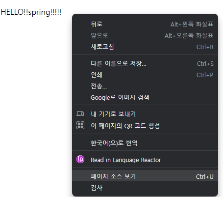

## 출처: 인프런의 [김영한님 강의](https://www.inflearn.com/course/%EC%8A%A4%ED%94%84%EB%A7%81-%EC%9E%85%EB%AC%B8-%EC%8A%A4%ED%94%84%EB%A7%81%EB%B6%80%ED%8A%B8) 를 바탕으로 공부한 것을 기록하는 repo입니다!

# java_springboot_project_practice

<details>
<summary>1. 프로젝트 환경설정 (정리 완)</summary>
<div markdown="1">

## 1. 프로젝트 환경설정 <br>
### 1-1. 프로젝트 생성
spring에서 운영하는 사이트로, spring boot 기반으로 프로젝트를 만들어주는 사이트

[spring initializer](https://start.spring.io/) 
 

<참고사이트: [[Java] Gradle, Groovy Gradle, Kotlin Gradle — 일단은 내 이야기](https://kdhyo98.tistory.com/87#Gradle%20%EC%9D%B4%EB%9E%80%3F-1), [Gradle User Manual](https://docs.gradle.org/current/userguide/userguide.html), [Kotlin DSL, Gradle 빌드 기본 언어 채택… 왜 Kotlin DSL일까?](https://blog.imqa.io/kotlin-dsl/), [‘Gradle Kotlin DSL’ 이야기 | 우아한형제들 기술블로그](https://techblog.woowahan.com/2625/)>

**Project**

- Gradle Groovy
  

**Language**

- Java
  

**Spring Boot**

- 원하는 버전, (SNAPSHOT - 만들고 있는 버전, M 시리즈 - 정식 릴리즈되지 않은 버전, 숫자만 있는 버전 - 정식 릴리즈 버전)
  

**Project metadata**

- Group - 보통 기업 도메인 명 (상관없다면 아무거나 적어도 무방)
  
- Artifact - 빌드 되어서 나오는 결과물
  
- Name, Description, Package name - 그대로 두거나 본인이 작성해도 무방
  

**ADD Dependencies...**

- 어떤 라이브러리를 이용할 것인가 정하는 것
  
- 웹 프로젝트라면 Spring web 검색해서 추가


**Generate**

- zip 파일이 다운되고 이를 Intellij에서 import하면 된다. <br><br>


  

Maven 이란

- 프로젝트를 진행하게 되면 많은 라이브러리들을 활용하게 되는데, 사용되는 그 수가 많아지면 이를 관리하는 것이 힘들어진다.
  
- Maven은 내가 사용한 라이브러리뿐만 아니라, 해당 라이브러리가 작동하는데 필요한 다른 라이브러리들까지 관리해서 네트워크를 통해 자동으로 다운 받아준다.
  
- 프로젝트의 전체적인 라이프사이클을 관리하는 도구이다.
  

Gradle 이란

- 기본적으로 빌드 배포 도구(Build Tool)이다.  JAVA, C/C++, Python 등을 지원한다.
  
- Maven은 XML로 라이브러리를 정의하고 활용하나 Gradle의 경우 별도의 빌드스크립트를 통해 사용할 어플리케이션 버전, 라이브러리 등의 항목을 설정할 수 있다.
  
- 장점으로는 스크립트 언어로 구성되어서 XML과 달리 변수 선언, if, else, for등의 로직이 구현가능하여 간결하게 코드 작성이 가능하다.
  

Gradle을 쓰는 이유

레거시 프로젝트, 과거 프로젝트의 경우 Maven으로 남아있는게 있지만, 요즘은 Gradle로 넘어가는 추세이다.<br><br><br>

<p align="center"></p>

- java 밑에 패키지와 소스파일이 있음
  
- test는 테스트 코드와 관련된 파일들이 들어가 있음
  
  - 요즘 개발 트렌드에서는 테스트코드가 중요하다는 것을 의미
    
- resource 파일은 java 코드 파일을 제외한 xml 이나 설정 파일들이 들어가 있음

## [IntelliJ] Java 버전 바꾸는 법(JDK 버전)
**<u>오류사항 발생</u>**
- No matching variant of org.springframework.boot:spring-boot-gradle-plugin:3.1.3 was found. The consumer was configured to find a library for use during runtime, compatible with Java 8, packaged as a jar, and its dependencies declared externally, as well as attribute 'org.gradle.plugin.api-version' with value '8.2.1' but:

### 1. Project(단축키 Crtl + Shift + Alt + S)
  
  - 스프링 부트 3버전 대부터는 JDK 17부터 지원하기 때문에 jdk 1.8(java8)로 빌드하려고 할 때 발생하는 오류
    
  - SDK 17로 설정
    
  - Language level: SDK default
<p align="center"></p>
    
### 2. Modules
  
  - Language level 변경
<p align="center"></p>
    
### 3. SDKs 설정
  
  - 원하는 JDK 설정  
<p align="center"></p>
  
### 4. Project Setting (단축키 Ctrl + Alt + S)
  
  - Build,Execution,Deployment  -> Build Tools -> Gradle
    
  - Gradle JVM 변경
<p align="center"></p>
    
  - Build,Execution,Deployment  -> Compiler -> Java Compiler
    
  - Project bytecode version 변경  
<p align="center"></p>
  
### 5. OS JDK 환경변수 설정 다시하기
  
<p align="center"></p>
<p align="center"></p>
  

## 수행 결과

<p align="center"></p>

- 여기서,
  
<p align="center"></p>
  
<p align="center"></p>
  
<p align="center"></p>
  
  - Stop하면
    
  
<p align="center"></p>
  
- 동작원리
  
   ```java
    @SpringBootApplication
    public class HelloSpringApplication {
    
    	public static void main(String[] args) {
    		SpringApplication.run(HelloSpringApplication.class, args);
    	}
    
    }
   ```
    
  - SpringApplication.run 안에 HelloSpringApplicatin이라는 클래스를 넣어주면 @SpringBootApplication 어노테이션을 통해서 springboot 어플리케이션이 실행이 된다.
    
  - Tomcat을 내장하고 있는데 자체적으로 서버를 띄움
    
- 번외
  
  - 인텔리제이가 자바를 실행하면 직접 실행하는 것이 아니라 Gradle을 통해서 실행하게 되는데 Gradle을 통해서 실행하게 되면 느릴 때가 있음
    
  - Intellij 로 바꾸면 Intellij에서 자바를 바로 실행시켜서 좀 더 빠르다. (프로젝트를 연습하는 단계에서는 좀 더 편하다)
 
<p align="center"></p>
<br><br>

### 1-2 라이브러리 살펴보기
<br>
<p align="center"></p> <br>
땡겨온 라이브러리 spring-web, thymeleaf는 각각 또다른 라이브러리에 의존하고 있음 <br>
의존하는 라이브러리까지 다 땡겨와서 이용하게 된다. <br>

##### Spring Boot 라이브러리
- spring-boot-starter-web 대표적으로
  
  - spring-boot-server-tomcat
    
  - spring-webmvc
    
- spring-boot-starter-thymeleaf는 html을 렌더링해주는 라이브러리 <br>
<p align="center"></p>
<br>

- spring-boot-starter
  
  - spring-boot
    
  - autoconfigure
    
  - logging
    
  - core 관련한 라이브러리가 들어있음
    
- spring-boot-starter-logging
  
  - logback(실제 log를 어떤 구현체로 실행할 것인지), slf4j(인터페이스)가 들어있다
- log와 관련한 내용
  
  - 현업에 있는 개발자들은 System.out.println으로 거의 출력하지 않는다.
    
  - log로 출력을 해야 한다.
    
  - log로 남겨야 심각한 에러들을 따로 파일로 모아서 관리가 가능하기 때문
    
  - 취준이나 신입들은 log를 왜 쓰지라고 생각할 수 있음.
    
- spring-boot-starter-test
  
  - junit (테스트 프레임워크)
    
  - mockito (mock 라이브러리)
    
  - assertj (테스트 코드 편하게 작성하게 도와주는 라이브러리)
    
  - spring-test (스프링 통합 테스트)
  <br><br>
  
  ### 1-3 View 환경설정
  <br>
  <p align="center"></p>
  <br>
  
  [spring-boot-docs](https://docs.spring.io/spring-boot/docs/current/reference/htmlsingle/#web.servlet.spring-mvc.welcome-page) 공식문서에서 내용을 찾을 수 있음

- main/resources/static 폴더 내에 index.html 파일을 만들어서 넣으면 Welcome page 기능을 제공한다.
  
<br>

- ```html
  <!DOCTYPE HTML>
  <html>
  <head>
      <title>Hello</title>
      <meta http-equiv="Content=Type" content="text/html; charset=UTF-8" />
  </head>
  <body>
  Hello
  <a href = "/hello">hello</a>
  </body>
  </html>
  ```
  <br>
  
- 단순히 파일을 서버에 던져준 것 밖에 안됨
  
- 템플릿 엔진이라는 것을 쓰면 모양을 바꿀 수 있다.
  
- 공식 사이트
  
  - [thymeleaf.org](https://www.thymeleaf.org/)
    
  - [스프링 공식 튜토리얼](https://spring.io/guides/gs/serving-web-content/)
    
  - [스프링 부트 메뉴얼](https://docs.spring.io/spring-boot/docs/current/reference/htmlsingle/)
    

- spring-boot-starter-thymeleaf가 위 html 파일을 꾸며주는 역할
  
- spring boot 메뉴얼 사이트에서도 지원하는 기능으로 thymeleaf가 있는 것을 확인할 수 있다.
<br>
<p align="center"></p>
<br>

```java
pacakage hello.hellospring;

import...

@SpringBootApplication
public class HelloSpringApplication{
    pubilc static void main(String[] args){
        SpringApplication.run(HelloSpringApplication.class, args);
    }
}
```
<br>

##### 화면 구성을 위한 작업

- Web Application에서 첫 진입이 Controller
  
- controller 패키지를 만든다.
  
- HelloController 클래스 파일을 만든다.

<br>
<p align="center"></p>
<br>

```java
import org.springframework.stereotype.Controller;
import org.springframework.ui.Model;
import org.springframework.web.bind.annotation.GetMapping;

@Controller
public class HelloController {
      // Web application에서 /hello 라고 입력값이 들어오면
      // @GetMapping 부분이 호출이 된다.
    @GetMapping("hello")
    public String hello(Model model){
        model.addAttribute("value", "welcome!!");
        return "hello";

    }
}
```
<br>

- Web application에서 /hello라고 입력값이 들어오면

```java
    @GetMapping("hello")
    public String hello(Model model){
        model.addAttribute("value", "welcome!!");
        return "hello";
```
<br>

- 위 코드 부분을 호출해준다.
  
- model은 MVC에서의 M에 해당
  
- Model 객체는 Controller에서 생성된 데이터를 View로 전달할 때 사용한다.

```html
<!DOCTYPE HTML>
<html xmlns:th="http://www.thymeleaf.org">
<head>
    <title>Hello</title>
    <meta http-equiv="Content-Type" content="text/html; charset = UTF-8"/>

</head>
<body>
<p th:text="'HELLO!!' + ${value}">처음이시군요. 고객님</p>
</body>
</html>
```
<br>

- 위 value값에 "welcome!!"이 들어가서 홈페이지에 <br>

<p align="center"></p>

- 위 그림처럼 뜨게 된다. <br><br>

##### 전체 과정 설명 <br>

<p align="center"></p> <br>

- 웹 브라우저가 localhost:8080에서 /hello를 스프링 부트쪽으로 던지게 되면 내장된 Tomcat server가 spring에게 다시 보내고
  
- spring은 HelloController를 찾은 뒤 이 내부에 <br>

```java
@Controller
public class HelloController {
      // Web application에서 /hello 라고 입력값이 들어오면
      // @GetMapping 부분이 호출이 된다.
    @GetMapping("hello")
    public String hello(Model model){
        model.addAttribute("value", "welcome!!");
        return "hello";

    }
}
```
<br>

- @GetMapping(get, post 에서의 get을 의미)의 "hello"와 매칭되게 됨
  
- 그러면 HelloController 내의 @GetMapping이 선언된 hello 라는 메서드가 실행된다.
  
- spring이 model을 만들어서 넘겨주는데 model에 "value"와 "welcome!!"을 담아서 view로 넘겨주게 된다
  
- return "hello";
<br>

<p align="center"></p> <br>

- hello.html로 model을 넘기는 것
  
- spring boot는 return "hello"; 하게 되면
  
- viewResolver에 의해서
  
- resource/templates 내의 hello를 찾게 된다.
  
- hello.html을 찾아서 랜더링한다.
  
- 요약: 컨트롤러에서 리턴 값으로 문자를 반환하면 'viewResolver'가 화면을 찾아서 처리한다.
  
  - spring boot 템플릿엔진 기본 viewName 매핑
    
  - `resources:template/` + {viewName} + `.html`
    
- 참고사항
  
  - `spring-boot-devtools` 라이브러리를 추가하면 `html` 파일을 컴파일만 해주면 서버 재시작 없이 view 파일 변경이 가능하다.
 
</div>
</details>
  
<details>
<summary>2. 스프링 웹 개발 기초 (정리완)</summary>
<div markdown="1">

## 2. 스프링 웹 개발 기초 <br>
  
크게 3가지 방법이 있음

- 정적 컨텐츠
  
  - 파일 자체를 웹 브라우저에 전달(서버에서 가공하지 않고 파일 전달)
    
  - 클라이언트의 요청을 받으면 서버에 미리 저장된 HTML, CSS, JS 등의 파일을 그대로 보여주는 것
    
  - 미리 저장된 파일을 그대로 보여주기 때문에 클라이언트들의 요청에 대해 동인한 결과를 보여준다.
    
- MVC 템플릿 엔진 (Model, View, Controller)
  
  - 서버에서 동적으로 HTML을 변환하여 웹 브라우저로 보내주는 역할
    
  - Model: 어플리케이션이 무엇을 할 것인지
    
  - View: 화면에 보여주기 위한
    
  - Controller: 모델이 어떻게 처리할지
    
- API
  
  - JSON과 같은 데이터 구조 포맷으로 클라이언트들에게 전달하는 방식, 화면은 클라이언트쪽에서 그린다.
    
  - 서버끼리는 html 필요없이 데이터만 주고 받으면 됨. 서버끼리 통신할 때 사용함
    
  - view 없이 그대로 http body에 전달하는 방식 <br>

  #### 2-1 정적 컨텐츠

- HTML 작성
  
  - spring boot는 정적 컨텐츠 기능을 제공한다. `/main/resources/static` 하위 폴더에 `hello-static.html` 파일을 생성하고 간단하게 살펴보기 위해서 아래 코드처럼 작성해본다.
    
    `hello-static.html`
    
    ```html
    <!DOCTYPE HTML>
    <html>
    <head>
        <title>static content</title>
        <meta http-equiv="Content-Type" content="text/html; charset=UTF-8" />
    
    </head>
    <body>
    정적 컨텐츠입니다.
    </body>
    </html>
    ```
    
- 클라이언트로부터 `localhost:8080/hello-static.html` 요청이 스프링 부트로 들어가게 되면 Tomcat 서버를 거치고 컨트롤러에서 `hello-static` 에 매핑하는 컨트롤러가 있는지 우선 확인한다.
  
- 즉, `hello-static` 관련 컨트롤러를 찾음.
  
- 동작이 없을 경우 `/resources/static` 하위에서 해당하는 파일을 찾아서 보내준다. <br>

#### 2-2 동적 컨텐츠
##### 2-2-1 MVC와 템플릿 엔진을 이용한 웹 개발 <br>

- MVC 라는 건 Model, View, Controller를 의미
  
- 과거에는 Controller와 View가 따로 분리되어 있지 않았음
  
- View에서 다 했음 (모델 1 방식)
  
- Model, View, Controller로 나누는 것이 일반적
  
- 위에서 만들었던 HelloController.java 파일에 추가를 해보자 (1-3 View 환경설정에서 헀음)
  
  ```java
  package com.example.hellospring.controller;
  
  import org.springframework.stereotype.Controller;
  import org.springframework.ui.Model;
  import org.springframework.web.bind.annotation.GetMapping;
  
  @Controller
  public class HelloController {
      @GetMapping("hello")
      public String hello(Model model){
          model.addAttribute("value", "welcome!!");
          return "hello";
  
      }
  
      // 추가된 부
      @GetMapping("hello-mvc")
      // @RequestParam 외부에서 값을 받겠다.
      // Model에 담으면 view에서 렌더링할 때 쓸 것
      public String helloMvc(@RequestParam("name") String name, Model model){ // 웹사이트 url을 바꿔서 값을 얻겠다.
          model.addAttribute("name", name); // "name" 이라는 key 값에 name value값을 model에 담는다.
          return "hello-template";
      }
  }
  ```
  
- `@RequesParam`: 외부에서 값을 받아서 View로 값을 넘겨준다.
  
  - `@RequestParam`("가져올 데이터의 이름") [데이터타입] [가져온데이터를 담을 변수]
- 여기서는 "name"이라는 String 타입 값을 받아서 Model 객체에 넣고, Model 객체를 View로 넘겨준다.
  
- 넘겨주는 html은 `hello-template.html` 이다.
  
- 그럼, `hello-template.html`을 만들고 간단하게 코드를 작성해보자
  

```html
<!DOCTYPE HTML>
<html xmlns:th="http://www.thymeleaf.org">
<body>
<p th:text="'HELLO!!' + ${name}">hello! client</p>
</body>
</html>
```

- `<p>`의 hello! client는 name값이 존재하게 되면 `HELLO!! {name}`으로 치환되게 된다.
  
- 이제 `http://localhost:8080/hello-mvc` 에 들어가보면 <br>

<p align="center"></p> <br>

- 에러가 뜨는 것을 확인할 수 있다. <br>

<p align="center"></p> <br>

<p align="center"></p> <br>

<p align="center"></p> <br>

- default가 true이며, 이는 넘어온 값이 존재해야 한다는 것을 의미
  
- 넘어온 name 값이 없어서 에러가 발생한 것
  
- 그러면 url 상에서 값을 넘겨줘보자 <br>

<p align="center"></p> <br>

<p align="center"></p> <br>

<p align="center"></p> <br>

- 페이지 소스 보기를 하면 이미지

<p align="center"></p> <br>

- HTML로 이루어진 것을 확인할 수 있다.
  
- `String name= spring!!!!!` 이 되고
  
- `model.addAttribute("name", name);` 에 의해 model에 담겨서 템플릿에 넘겨준다.
  
- `<p th:text="'HELLO!!' + ${name}">hello! client</p>` 에서 model의 key값인 name의 value 값을 받아서 `hello! client` 대신해서 `'HELLO!!' spring!!!!!`을 출력하게 된다.
  
- 정적 컨텐츠와는 다르게 HTML로 변환 후 웹 브라우저에 넘겨준다. <br>

##### 2-2-2 API 방식

１。이전에 만들었던 HelloController.java에 코드를 추가해보자

```java
    @GetMapping("hello-string")
    @ResponseBody // html의 body 태그가 아닌 http에서 header와 body 부분에서 body부분에 데이터를 직접 넣어주겠다.
    public String helloString(@RequestParam("name") String name){
        return "hello" + name;
    }
```

- 이전 템플릿 엔진과이 차이는 view가 없고 데이터 그대로 출력한다.
  
- 위에서 한 것처럼 페이지 소스보기를 하면 <br>

<p align="center"></p> <br>

- HTML이 아니라 데이터 그대로를 출력한 것을 확인할 수 있다. <br>

２。이전에 만들었던 HelloController.java에 코드를 추가해보자 <br>

```java
    @GetMapping("hello-api")
    @ResponseBody
    public Hello helloApi(@RequestParam("name") String name) {
        Hello hello = new Hello();
        hello.setName(name);
        return hello;
    }


    static class Hello{
        private String name;

        public String getName() {
            return name;
        }

        public void setName(String name) {
            this.name = name;
        }
    }
```
<br>

- Hello 타입의 hello 객체를 만들어서 입력 받은 name 값을 hello 객체에 넣어준다.
  
- 아까와 다르게 문자열이 아니라 객체를 return으로 넣어준다면? <br>

<p align="center"></p> <br>

- HTML이 아닌 데이터를 웹 브라우저로 보냈으며, JSON 형식으로 보낸 것을 확인할 수 있다. <br>

2-1. 동작 원리

<p align="center"></p> <br>

- @ResonseBody가 없다면
  
  - viewResolver가 템플릿을 찾고 HTML로 변환 후 웹 브라우저에 보냈음
- @ResponseBody를 사용한다면
  
  - 데이터를 그대로 넘기게 됨.
    
  - 문자라면 그대로 넘기는데 객체라면?
    
  - 객체라면 JSON 형식으로 반환해서 HTTP 응답으로 반환한다.
    
  - HTTP의 BODY 에 문자 내용을 직접 반환
    
  - `viewResolver` 대신에 `HttpMessageConverter` 가 동작한다.
    
  - 기본 문자처리: `StringHttpMessageConverter`
    
  - 기본 객체처리: `MappingJackson2HttpMessageConverter`
    
  - byte 처리 등등 기타 여러 HttpMessageConverter가 기본으로 등록되어 <br>

### 요약

- 정적 컨텐츠: 파일 그대로를 웹 브라우저에 보내는 방식
  
- 동적 컨텐츠
  
  - MVC 방식: HTML로 변환 후 웹 브라우저에 보내는 방식
    
  - API 방식: 데이터로 변환 후 웹 브라우저에 보내는 방식
    

```java
    static class Hello{
        private String name;

        public String getName() {
            return name;
        }

        public void setName(String name) {
            this.name = name
      }
```

- Getter Setter 개념
  
  - private으로 접근 못하게 하고
    
  - 외부에서 접근하려면 getName, setName으로 접근하게끔 하는 것
    
  - 이를 java bean 표준 방식이라고 한다.
    
  - 또 다른 용어로 property 접근 방식이라고 한다.
  


</div>
</details>

<details>
<summary>3. 회원 관리 예제 - 백엔드 개발</summary>
<div markdown="1">

</div>
</details>

<details>
<summary>4. 스프링 빈과 의존관계</summary>
<div markdown="1">

</div>
</details>

<details>
<summary>5. 회원관리 예제 - 웹 MVC 개발</summary>
<div markdown="1">

</div>
</details>

<details>
<summary>6. 스프링 DB 접근 기술</summary>
<div markdown="1">

</div>
</details>

<details>
<summary>7. AOP</summary>
<div markdown="1">

</div>
</details>
  

